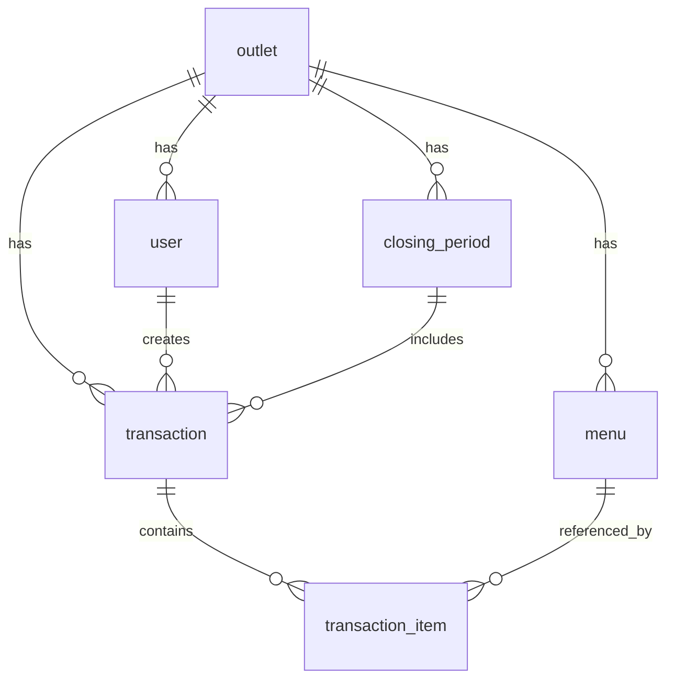

# PRD — Aplikasi Kasir Seafood & Nasi Uduk "Vian Jaya 08"

Versi: 1.0 (Draft untuk approval)
Status: **BELUM DISETUJUI — jangan mulai implementasi sebelum semua OPEN QUESTION dijawab dan PRD ini di-approve.**

---

# 1. Product Overview

- **Nama produk:** Kasir Vian Jaya 08 (working title, bisa diganti)
- **Ringkasan produk:** Aplikasi kasir berbasis web untuk mencatat pesanan (meja, menu makanan, menu minuman, qty), mencetak struk, dan menarik rekap penjualan harian. Dipakai untuk 3 outlet warung dengan nama sama dalam satu aplikasi multi-tenant.
- **Masalah utama yang diselesaikan:** Pencatatan pesanan dan rekap penjualan manual (kertas/kalkulator) rawan salah hitung, lambat, dan sulit ditarik datanya saat tutup kasir.
- **Nilai utama produk:** Input pesanan cepat → cetak struk → rekap otomatis saat tutup, tanpa perlu manajemen stok bahan baku (di luar scope).
- **Platform:** Web app, online-only (butuh koneksi internet aktif saat transaksi).
- **Target pengguna:** Kasir dan owner/admin warung makan seafood & nasi uduk, 3 outlet dengan brand sama.

---

# 2. Problem Statement

- **Siapa yang mengalami masalah:** Kasir dan owner warung Vian Jaya 08 di 3 outlet.
- **Masalah yang dialami:** Pencatatan pesanan manual, tidak ada struk konsisten, rekap penjualan harian dihitung manual saat tutup.
- **Penyebab masalah:** Belum ada sistem pencatatan digital yang sesuai kebutuhan warung kecil (tanpa fitur stok yang justru menambah kompleksitas tidak perlu).
- **Dampak masalah:** Potensi selisih kas, waktu tutup kasir lama, tidak ada data historis untuk evaluasi penjualan per outlet.
- **Mengapa perlu diselesaikan:** Operasional 3 outlet butuh visibilitas data penjualan yang konsisten dan cepat ditarik oleh owner.

---

# 3. Target Users & Personas

### Persona 1 — Kasir
- **Role:** Kasir outlet (per outlet, tidak lintas outlet)
- **Tujuan:** Input pesanan secepat mungkin, cetak struk, tutup kasir di akhir shift.
- **Kebutuhan:** UI simple, minim klik, jelas total per meja.
- **Pain points:** Tidak familiar teknologi kompleks, butuh alur linear (bukan banyak menu tersembunyi).
- **Perilaku utama:** Buka app di device outlet, login, input pesanan berkali-kali sepanjang hari, print struk tiap transaksi.

### Persona 2 — Owner/Admin
- **Role:** Pemilik/pengelola, akses ke 3 outlet.
- **Tujuan:** Kelola menu & harga, pantau rekap penjualan tiap outlet, tarik laporan tutup kasir.
- **Kebutuhan:** Lihat rekap per outlet dan (opsional) gabungan, export data.
- **Pain points:** Tidak selalu di lokasi outlet, butuh akses jarak jauh ke data.
- **Perilaku utama:** Login dari device manapun, cek dashboard, export laporan harian/periodik.

---

# 4. Goals & Non-Goals

## Goals
- Kasir bisa mencatat pesanan per meja (menu makanan, minuman, qty) dengan cepat.
- Setiap transaksi bisa langsung dicetak sebagai struk (thermal printer).
- Owner/admin bisa menarik rekap penjualan (qty & total sales) per outlet, saat tutup kasir maupun periodik, dalam bentuk print dan export.
- Satu aplikasi melayani 3 outlet dengan data yang terpisah secara logis (multi-tenant).
- Login sederhana untuk kasir dan admin.

## Non-Goals
- **Tidak ada manajemen stok bahan baku** (secara eksplisit di luar scope).
- Tidak ada fitur reservasi meja.
- Tidak ada integrasi payment gateway/QRIS otomatis di MVP (lihat Open Question).
- Tidak ada fitur loyalty/membership pelanggan.
- Tidak ada aplikasi mobile native (MVP web-only).

---

# 5. User Roles & Permissions

| Aspek | Kasir | Owner/Admin |
|---|---|---|
| Hak akses | Terbatas pada outlet tempat dia terdaftar | Akses ke seluruh outlet miliknya |
| Fitur | Input pesanan, print struk, tutup kasir (shift outlet-nya) | Semua fitur kasir + kelola menu & harga + lihat/export rekap semua outlet |
| Data dilihat | Transaksi & rekap outlet sendiri, hari berjalan (histori terbatas — lihat Open Question) | Semua transaksi & rekap seluruh outlet, semua periode |
| Data dibuat | Transaksi pesanan | Menu, kategori menu, harga, akun kasir |
| Data diubah | Pesanan sebelum di-print/finalize | Menu, harga, akun kasir |
| Data dihapus | Item pesanan sebelum finalize | Menu (soft delete/nonaktifkan), akun kasir |

**Catatan:** Tidak ada role "Superadmin lintas 3 outlet dengan owner berbeda" — asumsi 1 owner untuk 3 outlet. Jika owner tiap outlet berbeda-beda, ini mengubah struktur permission (lihat Open Question Q1).

---

# 6. User Stories

- Sebagai **kasir**, saya ingin memilih nomor meja lalu menambahkan menu makanan/minuman beserta qty, supaya pesanan tercatat sesuai kondisi lapangan.
- Sebagai **kasir**, saya ingin mencetak struk setelah pesanan selesai diinput, supaya pelanggan punya bukti transaksi.
- Sebagai **kasir**, saya ingin menutup kasir di akhir shift dan melihat rekap hari itu, supaya saya bisa serah terima kas.
- Sebagai **owner**, saya ingin login dan memilih outlet mana yang ingin saya lihat, supaya saya bisa memantau tiap outlet secara terpisah.
- Sebagai **owner**, saya ingin menambah/mengubah menu dan harga, supaya kasir selalu memakai data terbaru.
- Sebagai **owner**, saya ingin export rekap penjualan (qty & sales) ke Excel/PDF, supaya saya punya data untuk pembukuan.
- Sebagai **owner**, saya ingin membuat akun kasir baru per outlet, supaya staf baru bisa langsung pakai sistem.

---

# 7. User Flow

**Flow Kasir (utama):**
Login → Pilih/otomatis terhubung ke outlet-nya → Dashboard kasir → Pilih meja → Tambah item menu (makanan/minuman + qty) → Review pesanan → Simpan & Print struk → (ulangi untuk meja lain) → Akhir shift: Tutup Kasir → Lihat rekap hari itu → Print/Export rekap.

**Flow Owner/Admin:**
Login → Pilih outlet (atau lihat semua) → Dashboard rekap → [Cabang A] Kelola Menu (tambah/edit/nonaktifkan) → [Cabang B] Lihat Laporan Penjualan (filter tanggal) → Export/Print.

**Branching:**
- Jika pesanan belum di-print dan kasir ingin ubah qty/hapus item → boleh edit selama status "belum finalize".
- Jika sudah print → transaksi dianggap final, perubahan butuh mekanisme "void/cancel transaksi" (lihat Open Question — apakah dibutuhkan di MVP).

---

# 8. Feature Scope

## MVP

| Fitur | Tujuan | Prioritas | Role | Dependensi |
|---|---|---|---|---|
| Login sederhana | Akses per role & outlet | Wajib | Semua | Auth |
| Input pesanan (meja, menu, qty) | Core transaksi | Wajib | Kasir | Menu data |
| Cetak struk (thermal) | Bukti transaksi | Wajib | Kasir | Input pesanan |
| Kelola menu & harga | Data dasar transaksi | Wajib | Owner | - |
| Tutup kasir (rekap harian per outlet) | Rekap operasional | Wajib | Kasir/Owner | Input pesanan |
| Export laporan (Excel/PDF) | Data untuk pembukuan | Wajib | Owner | Rekap |
| Manajemen akun kasir per outlet | Multi-tenant access | Wajib | Owner | Auth |

## V2
- Void/cancel transaksi dengan alasan & log.
- Metode pembayaran (cash/QRIS) tercatat per transaksi.
- Dashboard perbandingan penjualan antar 3 outlet.
- Diskon per item/transaksi.

## Future
- Integrasi payment gateway.
- Aplikasi mobile untuk owner.
- Laporan analitik lanjutan (menu terlaris, jam ramai, dsb).

---

# 9. Functional Requirements

### Input Pesanan

**Purpose:** Mencatat pesanan per meja secara cepat.
**Actor:** Kasir.
**Precondition:** Kasir sudah login, outlet & menu tersedia.
**Input:** Nomor meja, daftar item menu (makanan/minuman) + qty per item.
**Process:** Sistem menghitung subtotal per item dan total pesanan otomatis berdasarkan harga menu aktif.
**Validation:** Nomor meja wajib diisi; minimal 1 item dengan qty ≥ 1; harga menu harus valid (tidak null/0 kecuali memang gratis — lihat Open Question).
**Business Rules:** Harga mengikuti harga menu yang berlaku saat transaksi dibuat (bukan harga saat ini jika sudah berubah di kemudian hari — untuk konsistensi histori).
**Output:** Draft pesanan dengan rincian item, qty, subtotal, total.
**Success State:** Pesanan tersimpan dengan status "draft"/"open", siap di-print.
**Failure State:** Validasi gagal → pesan error spesifik per field; error server → retry, pesanan tidak hilang (autosave draft).
**Acceptance Criteria:**
```
Given kasir sudah login di outlet A
When kasir memilih meja 5, menambahkan "Ikan Bakar" qty 2 dan "Es Teh" qty 3
Then sistem menghitung total otomatis dan menampilkan rincian sebelum disimpan
```

### Cetak Struk

**Purpose:** Mencetak bukti transaksi ke thermal printer.
**Actor:** Kasir.
**Precondition:** Pesanan sudah diinput dan disimpan.
**Input:** Trigger tombol "Print".
**Process:** Sistem generate format struk (nomor meja, item, qty, harga, total, tanggal/jam, nama outlet) dan mengirim ke printer.
**Validation:** Pesanan harus punya minimal 1 item.
**Business Rules:** Setelah print, transaksi berstatus "final" (lihat Open Question soal edit setelah print).
**Output:** Struk tercetak fisik + record transaksi tersimpan sebagai final.
**Success State:** Struk berhasil dicetak, transaksi masuk rekap.
**Failure State:** Printer tidak terhubung/error → tampilkan pesan error, transaksi tetap tersimpan sebagai final (data tidak hilang), beri opsi "print ulang".
**Acceptance Criteria:**
```
Given pesanan meja 5 sudah disimpan
When kasir menekan tombol Print
Then struk tercetak berisi nama outlet, meja, daftar item, qty, harga, total, dan waktu transaksi
```

### Kelola Menu & Harga

**Purpose:** Owner mengatur daftar menu yang bisa dipilih kasir.
**Actor:** Owner/Admin.
**Precondition:** Login sebagai owner.
**Input:** Nama menu, kategori (makanan/minuman), harga, status aktif/nonaktif.
**Process:** CRUD menu per outlet (menu bisa sama/berbeda antar outlet — lihat Open Question).
**Validation:** Nama menu wajib, harga wajib angka > 0.
**Business Rules:** Menu yang dinonaktifkan tidak muncul di layar kasir tapi tetap ada di histori transaksi lama.
**Output:** Daftar menu ter-update, langsung tersedia di layar kasir.
**Success State:** Menu tersimpan dan muncul di list kasir.
**Failure State:** Validasi gagal → error per field.
**Acceptance Criteria:**
```
Given owner login dan memilih outlet A
When owner menambahkan menu "Nasi Uduk Ayam" harga 15000, kategori makanan
Then menu tersebut langsung muncul di pilihan kasir outlet A
```

### Tutup Kasir & Rekap

**Purpose:** Menutup shift dan menampilkan rekap penjualan hari itu.
**Actor:** Kasir (trigger) / Owner (lihat kapan saja).
**Precondition:** Ada transaksi final pada periode berjalan.
**Input:** Trigger "Tutup Kasir" (opsional catatan/nominal kas fisik — lihat Open Question).
**Process:** Sistem menjumlahkan seluruh transaksi final pada periode tersebut: total qty per menu, total sales.
**Validation:** -
**Business Rules:** Setelah tutup kasir, periode tersebut dikunci (transaksi baru masuk periode berikutnya).
**Output:** Rekap: daftar menu terjual + qty, total sales, jumlah transaksi.
**Success State:** Rekap tampil, bisa di-print dan export.
**Failure State:** Tidak ada transaksi → tampilkan rekap kosong dengan pesan jelas, bukan error.
**Acceptance Criteria:**
```
Given ada 10 transaksi final di outlet A hari ini
When kasir menekan "Tutup Kasir"
Then sistem menampilkan rekap total qty per menu dan total sales, siap di-print/export
```

### Export Laporan

**Purpose:** Owner menarik data untuk pembukuan eksternal.
**Actor:** Owner/Admin.
**Precondition:** Ada data rekap pada rentang tanggal yang dipilih.
**Input:** Rentang tanggal, outlet (satu/semua).
**Process:** Sistem generate file Excel/PDF berisi rekap.
**Validation:** Rentang tanggal valid (start ≤ end).
**Business Rules:** Data yang di-export adalah transaksi final saja.
**Output:** File Excel dan/atau PDF.
**Success State:** File terunduh.
**Failure State:** Tidak ada data pada rentang → pesan jelas, tidak generate file kosong membingungkan.
**Acceptance Criteria:**
```
Given owner memilih rentang 1-7 September, outlet A
When owner menekan "Export"
Then sistem mengunduh file Excel berisi rekap qty & sales harian pada rentang tersebut
```

---

# 10. UI/UX Requirements

### Halaman Login
- **Tujuan:** Autentikasi kasir/owner.
- **Role:** Semua.
- **Komponen:** Form username + password, tombol login.
- **Error state:** Kredensial salah → pesan jelas.
- **Loading state:** Tombol disabled + spinner saat submit.
- **Responsive:** Optimal di tablet/PC kasir (min-width 768px) dan mobile untuk owner.

### Halaman Kasir — Input Pesanan
- **Tujuan:** Input pesanan per meja.
- **Role:** Kasir.
- **Komponen:** Selector nomor meja, list menu (grid/kategori tab makanan-minuman), qty stepper per item, ringkasan total di sisi/bawah.
- **Input field:** Qty per item.
- **Button/action:** Tambah item, Simpan, Print, Batal.
- **Empty state:** Belum ada menu → arahkan owner untuk isi menu dulu.
- **Loading state:** Saat simpan/print.
- **Error state:** Gagal simpan/print → retry.
- **Responsive:** Prioritas tablet landscape.

### Halaman Tutup Kasir / Rekap
- **Tujuan:** Lihat & aksi rekap harian.
- **Role:** Kasir (outlet sendiri), Owner (semua outlet).
- **Komponen:** Tabel qty per menu, total sales, filter tanggal (owner), tombol Print & Export.
- **Empty state:** Belum ada transaksi.
- **Responsive:** Tabel scrollable di mobile.

### Halaman Kelola Menu
- **Tujuan:** CRUD menu & harga.
- **Role:** Owner.
- **Komponen:** Tabel menu (nama, kategori, harga, status), form tambah/edit, toggle aktif/nonaktif.
- **Filter/search:** Cari menu by nama, filter kategori.
- **Empty state:** Belum ada menu.

### Halaman Manajemen Akun Kasir
- **Tujuan:** Owner membuat/kelola akun kasir per outlet.
- **Role:** Owner.
- **Komponen:** Tabel akun, form tambah (username, password, outlet assignment).

*Desain visual (warna, tipografi, dsb.) belum ditentukan — **OPEN QUESTION**.*

---

# 11. Data Model

### Entity: `outlet`
| Field | Type | Required | Default | Unique | Keterangan |
|---|---|---|---|---|---|
| id | UUID | Ya | auto | Ya (PK) | |
| name | string | Ya | - | - | Nama outlet, mis. "Vian Jaya 08 - Cabang 1" |
| created_at | timestamp | Ya | now() | - | |

### Entity: `user`
| Field | Type | Required | Default | Unique | Keterangan |
|---|---|---|---|---|---|
| id | UUID | Ya | auto | Ya (PK) | |
| username | string | Ya | - | Ya | |
| password_hash | string | Ya | - | - | Hashed (bcrypt) |
| role | enum(owner, kasir) | Ya | - | - | |
| outlet_id | UUID (nullable) | Kasir: Ya, Owner: N/A | null | - | FK ke outlet; null jika owner (akses semua outlet) |
| is_active | boolean | Ya | true | - | |
| created_at | timestamp | Ya | now() | - | |

### Entity: `menu`
| Field | Type | Required | Default | Unique | Keterangan |
|---|---|---|---|---|---|
| id | UUID | Ya | auto | Ya (PK) | |
| outlet_id | UUID | Ya | - | - | FK ke outlet |
| name | string | Ya | - | - | |
| category | enum(makanan, minuman) | Ya | - | - | |
| price | decimal | Ya | - | - | |
| is_active | boolean | Ya | true | - | |
| created_at | timestamp | Ya | now() | - | |

### Entity: `transaction`
| Field | Type | Required | Default | Unique | Keterangan |
|---|---|---|---|---|---|
| id | UUID | Ya | auto | Ya (PK) | |
| outlet_id | UUID | Ya | - | - | FK ke outlet |
| table_number | string | Ya | - | - | |
| cashier_id | UUID | Ya | - | - | FK ke user |
| status | enum(draft, final) | Ya | draft | - | |
| total_amount | decimal | Ya | 0 | - | Dihitung dari transaction_item |
| printed_at | timestamp (nullable) | - | null | - | |
| closed_period_id | UUID (nullable) | - | null | - | FK ke closing_period, null jika belum ditutup |
| created_at | timestamp | Ya | now() | - | |

### Entity: `transaction_item`
| Field | Type | Required | Default | Unique | Keterangan |
|---|---|---|---|---|---|
| id | UUID | Ya | auto | Ya (PK) | |
| transaction_id | UUID | Ya | - | - | FK ke transaction |
| menu_id | UUID | Ya | - | - | FK ke menu |
| menu_name_snapshot | string | Ya | - | - | Snapshot nama (jaga histori jika menu diubah/dihapus) |
| price_snapshot | decimal | Ya | - | - | Snapshot harga saat transaksi |
| qty | integer | Ya | - | - | |
| subtotal | decimal | Ya | - | - | price_snapshot × qty |

### Entity: `closing_period`
| Field | Type | Required | Default | Unique | Keterangan |
|---|---|---|---|---|---|
| id | UUID | Ya | auto | Ya (PK) | |
| outlet_id | UUID | Ya | - | - | FK ke outlet |
| closed_by | UUID | Ya | - | - | FK ke user |
| period_start | timestamp | Ya | - | - | |
| period_end | timestamp | Ya | - | - | |
| total_sales | decimal | Ya | - | - | |
| total_transactions | integer | Ya | - | - | |
| created_at | timestamp | Ya | now() | - | |

### Relationship (ERD)



---

# 12. API / Backend Requirements

**Authentication:** Session/JWT (lihat Section 13). Semua endpoint di bawah butuh auth kecuali login.
**Authorization:** Kasir hanya bisa akses data `outlet_id` miliknya sendiri; owner bisa pilih outlet via query param.

```
POST /api/auth/login
Request: { "username": "string", "password": "string" }
Response 200: { "token": "string", "role": "owner|kasir", "outlet_id": "uuid|null" }
Response 401: { "error": "Kredensial tidak valid" }
```

```
GET /api/menu?outlet_id={id}
Authorization: kasir (outlet sendiri) | owner (semua)
Response 200: [{ "id", "name", "category", "price", "is_active" }]
```

```
POST /api/menu
Authorization: owner only
Request: { "outlet_id", "name", "category", "price" }
Response 201: { menu object }
Response 400: { "error": "Validasi gagal", "fields": {...} }
```

```
POST /api/transactions
Authorization: kasir
Request: { "table_number", "items": [{ "menu_id", "qty" }] }
Response 201: { transaction object with computed total }
Response 400: { "error": "Item tidak valid / qty ≤ 0" }
```

```
POST /api/transactions/{id}/print
Authorization: kasir (outlet sendiri)
Response 200: { "status": "final", "printed_at": "timestamp" }
```

```
POST /api/closing
Authorization: kasir, owner
Request: { "outlet_id" }
Response 200: { closing_period object + rekap detail per menu }
```

```
GET /api/reports/export?outlet_id={id}&start={date}&end={date}&format={excel|pdf}
Authorization: owner
Response 200: file binary (Content-Disposition: attachment)
Response 404: { "error": "Tidak ada data pada rentang ini" }
```

---

# 13. Authentication & Authorization

- **Login:** Username + password sederhana (bukan email, bukan OTP) — sesuai permintaan awal.
- **Logout:** Invalidate session/token di client (dan blacklist token di server jika pakai JWT dengan refresh token; jika session-based, hapus session di server).
- **Session/token:** **OPEN QUESTION** — rekomendasi: session-based dengan cookie httpOnly (lebih simple & aman untuk web app single-domain, tidak perlu handle refresh token manual seperti JWT).
- **Password handling:** Hash dengan bcrypt, minimal panjang password (rekomendasi 6 karakter untuk kemudahan kasir, trade-off keamanan vs simplicity — **OPEN QUESTION** untuk konfirmasi).
- **Role-based access:** owner vs kasir, kasir terikat `outlet_id`.
- **Permission checking:** Setiap request kasir divalidasi `outlet_id` di token/session cocok dengan resource yang diakses.
- **Unauthorized state:** 401 redirect ke login; 403 untuk role yang tidak berhak (mis. kasir akses endpoint kelola menu).
- **Session expiration:** **OPEN QUESTION** — rekomendasi 12 jam (mencakup 1 shift kerja) agar kasir tidak perlu login berkali-kali dalam sehari.

---

# 14. Non-Functional Requirements

- **Performance:** Input pesanan & print harus responsif < 1 detik untuk aksi UI (di luar waktu print fisik).
- **Security:** Password hashing, HTTPS wajib, validasi authorization tiap endpoint per outlet.
- **Scalability:** Desain multi-tenant harus mudah menambah outlet ke-4 dst tanpa perubahan struktur data.
- **Availability:** Tidak ada SLA formal (warung kecil), tapi hosting harus stabil untuk jam operasional warung.
- **Accessibility:** Kontras warna cukup, ukuran tombol touch-friendly (kasir kemungkinan pakai tablet/touchscreen).
- **Responsive design:** Wajib untuk layar kasir (tablet) dan dashboard owner (mobile & desktop).
- **Data backup:** **OPEN QUESTION** — rekomendasi backup otomatis harian jika pakai managed database (mis. Supabase/Neon punya built-in backup).
- **Logging:** Log transaksi (siapa buat, kapan) sudah tercakup di data model; log error server minimal untuk debugging.
- **Error handling:** Semua error API mengembalikan pesan yang bisa ditampilkan langsung ke user (bukan raw stack trace).
- **Browser/device support:** Chrome/Edge terbaru (untuk kompatibilitas thermal printer via browser print), device tablet/PC di outlet.

---

# 15. Edge Cases & Failure States

| Kondisi | Expected Behavior |
|---|---|
| Nomor meja kosong | Validasi block simpan, pesan error di field |
| Qty ≤ 0 atau kosong | Validasi block, tidak bisa ditambahkan ke pesanan |
| Menu dihapus/nonaktif saat transaksi lama dilihat | Tampilkan `menu_name_snapshot`, bukan data menu terkini |
| Transaksi sudah final tapi mau diubah | Ditolak sistem — perlu fitur void terpisah (V2), MVP: tidak bisa diubah |
| Printer tidak terhubung | Transaksi tetap tersimpan final, tampilkan error print + tombol "cetak ulang" |
| Network error saat simpan pesanan | Tampilkan retry, jangan hilangkan input yang sudah diketik (local state tetap) |
| Tutup kasir 2x di periode yang sama | Ditolak — periode sudah closed, tidak bisa dobel tutup |
| User tidak punya permission (kasir akses kelola menu) | 403, redirect ke halaman yang diizinkan |
| Export tanpa data pada rentang | Pesan jelas "tidak ada data", tidak generate file kosong |
| Session expired saat input pesanan | Simpan draft di local state jika memungkinkan, redirect ke login, setelah login kembalikan draft jika masih ada |
| Concurrent: 2 kasir input meja sama bersamaan | Diperbolehkan — nomor meja bukan unique constraint, bisa multiple transaksi aktif per meja (mis. tambah pesanan) — **OPEN QUESTION** apakah ini perilaku yang diinginkan |

---

# 16. Technical Requirements

| Layer | Rekomendasi | Alasan |
|---|---|---|
| Frontend | Next.js + TypeScript + Tailwind CSS | Full-stack dalam satu framework, cocok untuk app skala kecil-menengah, deployment mudah |
| Backend | Next.js API Routes (atau App Router server actions) | Menghindari maintain 2 codebase terpisah untuk app sekecil ini |
| Database | PostgreSQL (mis. via Neon/Supabase) | Relational cocok untuk multi-tenant dengan `outlet_id`, robust untuk data transaksi |
| ORM | Prisma | Type-safe query, migration terkelola |
| Authentication | Session-based, cookie httpOnly + bcrypt | Simple sesuai requirement, cukup aman untuk skala ini |
| Printing | Browser print (`window.print`) ke printer thermal yang terdaftar sebagai printer sistem (driver USB) | Lebih reliable & cross-platform dibanding raw ESC/POS via WebUSB/WebBluetooth yang kompleks dan terbatas ke Chrome. **Trade-off: printer Bluetooth kemungkinan perlu app companion/driver OS, bukan native Web Bluetooth — OPEN QUESTION, lihat Q7** |
| Export | `exceljs` (Excel), `@react-pdf/renderer` atau `pdf-lib` (PDF) | Library umum, ringan |
| Deployment | Vercel (frontend+API) + managed Postgres | Cocok untuk Next.js, minim setup DevOps |
| Environment variables | `DATABASE_URL`, `SESSION_SECRET` | Wajib tidak hardcode |

**Package utama:** `next`, `typescript`, `prisma`, `bcrypt`, `exceljs`, `tailwindcss`.

---

# 17. Security Requirements

- **Authentication:** Password hashing bcrypt (cost factor ≥ 10).
- **Authorization:** Middleware cek role + `outlet_id` di setiap request.
- **Input validation:** Validasi server-side untuk semua endpoint (jangan andalkan validasi client saja) — rekomendasi `zod`.
- **SQL injection:** Aman by default karena pakai Prisma (parameterized query).
- **XSS:** Sanitize input nama menu/meja sebelum render; Next.js React escape by default.
- **CSRF:** Jika session cookie-based, wajib CSRF token untuk mutasi (POST/PUT/DELETE).
- **Rate limiting:** Rekomendasi rate limit endpoint login untuk cegah brute force (mis. 5x gagal → lock sementara).
- **File upload security:** Tidak ada fitur upload file di MVP ini.
- **Sensitive data protection:** Password tidak pernah dikirim balik di response manapun.
- **Password security:** Minimal policy dasar (lihat Section 13 Open Question).
- **Audit logging:** Minimal: siapa buat transaksi, siapa tutup kasir, siapa ubah menu (sudah tercakup via `created_by`/`closed_by`).

---

# 18. Acceptance Criteria & Definition of Done

Fitur dianggap selesai jika:
- [ ] Functional requirement (Section 9) terpenuhi & lulus acceptance criteria.
- [ ] Validasi input (client & server) bekerja sesuai spesifikasi.
- [ ] Semua error state (Section 15) ditangani dengan pesan jelas, bukan crash/blank screen.
- [ ] Permission per role & outlet bekerja (kasir tidak bisa akses outlet lain).
- [ ] UI responsive di tablet (kasir) dan mobile/desktop (owner).
- [ ] Database migration tersedia dan bisa dijalankan ulang (idempotent).
- [ ] Print struk teruji di minimal 1 thermal printer fisik.
- [ ] Export Excel & PDF menghasilkan file valid dan bisa dibuka.
- [ ] Tidak ada critical error di console/server log saat flow utama dijalankan.

---

# 19. Success Metrics

**Product metrics:**
- Waktu rata-rata input 1 pesanan (target: OPEN QUESTION — belum ada baseline).

**User metrics:**
- Jumlah kasir aktif menggunakan sistem harian per outlet.

**Business metrics:**
- Total sales tercatat per outlet per hari (data langsung tersedia dari sistem).

**Technical metrics:**
- Error rate API < 1% (rekomendasi umum, bisa disesuaikan).
- Uptime aplikasi selama jam operasional warung.

Target angka spesifik: **OPEN QUESTION — membutuhkan keputusan user.**

---

# 20. MVP Implementation Order

1. **Foundation:** Setup project Next.js + TypeScript + Tailwind, struktur folder, Prisma setup.
2. **Database:** Migration seluruh entity (Section 11), seed data awal (1-3 outlet dummy).
3. **Authentication:** Login, session, role middleware, permission per outlet.
4. **Core feature:** Kelola menu (owner) → Input pesanan (kasir) → Print struk. (Urutan ini karena input pesanan butuh menu sudah ada.)
5. **Supporting features:** Tutup kasir & rekap, export Excel/PDF.
6. **UI polish:** Responsive check, empty/loading/error states konsisten.
7. **Testing:** Manual test seluruh acceptance criteria + test print di printer fisik.
8. **Deployment:** Setup Vercel + database production, environment variables, domain (jika ada).

Dependensi: Step 4 tidak bisa mulai sebelum step 3 selesai (butuh auth & outlet context). Step 5 butuh step 4 (transaksi) sudah berjalan.

---

# 21. AI Coding Instructions

AI coding agent **HARUS**:
1. Membaca PRD ini sebelum menulis kode apa pun.
2. Tidak membuat fitur di luar scope MVP (Section 8) tanpa persetujuan eksplisit.
3. Tidak mengubah requirement di PRD ini secara sepihak.
4. Jika requirement ambigu atau termasuk Open Question yang belum dijawab, **berhenti** dan tanyakan klarifikasi — jangan menebak.
5. Mengikuti architecture (Section 16) dan data model (Section 11) yang telah ditentukan.
6. Membuat perubahan bertahap per fitur dan dapat diuji sendiri-sendiri (bukan 1 commit besar semua fitur).
7. Tidak menghapus functionality yang sudah berjalan tanpa alasan jelas.
8. Menjaga backward compatibility data jika ada perubahan struktur di kemudian hari.
9. Menulis migration Prisma setiap kali struktur database berubah.
10. Melakukan validation (client + server) dan error handling sesuai Section 15.
11. Tidak menyimpan secret/API key di source code — gunakan environment variables.
12. Menjalankan lint/build/test setelah setiap perubahan signifikan.
13. Melaporkan file yang dibuat/diubah di akhir setiap task.
14. Menjelaskan hasil implementasi dan masalah yang ditemukan (termasuk kalau ada Open Question yang ternyata menghambat implementasi).

---

# 22. Development Milestones

**Milestone 1 — Foundation & Auth**
- Scope: Setup project, database, login, role/permission per outlet.
- Task: Section 20 step 1-3.
- Dependency: -
- Acceptance criteria: Kasir & owner bisa login dan diarahkan ke halaman sesuai role; kasir tidak bisa akses data outlet lain.
- Expected output: App berjalan lokal dengan auth berfungsi.

**Milestone 2 — Core Transaksi**
- Scope: Kelola menu, input pesanan, print struk.
- Task: Section 20 step 4.
- Dependency: Milestone 1.
- Acceptance criteria: Owner bisa CRUD menu; kasir bisa input pesanan dan print struk sesuai acceptance criteria Section 9.
- Expected output: Alur kasir end-to-end berfungsi.

**Milestone 3 — Rekap & Export**
- Scope: Tutup kasir, rekap, export Excel/PDF.
- Task: Section 20 step 5.
- Dependency: Milestone 2.
- Acceptance criteria: Rekap akurat sesuai transaksi final; export menghasilkan file valid.
- Expected output: Owner bisa menarik laporan penjualan.

**Milestone 4 — Polish & Deploy**
- Scope: Responsive, error states, deployment.
- Task: Section 20 step 6-8.
- Dependency: Milestone 3.
- Acceptance criteria: Section 18 Definition of Done terpenuhi seluruhnya.
- Expected output: Aplikasi live dan siap dipakai 3 outlet.

---

# 23. Open Questions

**Q1. Apakah 1 owner untuk 3 outlet, atau tiap outlet punya owner berbeda?**
Impact: Tinggi
Recommended decision: 1 owner untuk 3 outlet (sesuai konteks "3 warung dengan nama sama").
Reason: Mempengaruhi struktur permission — jika owner berbeda, perlu role tambahan "Super Admin" di atas 3 owner.

**Q2. Apakah menu & harga sama persis di 3 outlet, atau bisa berbeda per outlet?**
Impact: Sedang
Recommended decision: Menu per outlet independen (sesuai data model saat ini) walau kemungkinan besar isinya sama — lebih fleksibel untuk perbedaan harga lokal.
Reason: Mempengaruhi UX kelola menu (apakah perlu fitur "copy menu ke outlet lain").

**Q3. Metode pembayaran apa saja yang perlu dicatat (cash saja, atau juga QRIS/transfer)?**
Impact: Sedang
Recommended decision: Cash-only untuk MVP, field metode pembayaran ditambahkan di V2.
Reason: Tidak disebutkan di brief awal; menambah field ini di MVP menambah scope tanpa kebutuhan eksplisit.

**Q4. Apakah nomor meja dari daftar tetap (mis. Meja 1-15) atau input bebas?**
Impact: Rendah-Sedang
Recommended decision: Daftar tetap per outlet (lebih cepat untuk kasir, less error) — jumlah meja dikonfigurasi owner.
Reason: Mempengaruhi desain UI Section 10 (selector vs text input).

**Q5. Apakah dibutuhkan fitur void/cancel transaksi yang sudah final di MVP?**
Impact: Tinggi
Recommended decision: Tidak di MVP (masuk V2 dengan audit log), karena brief awal tidak menyebutkan kebutuhan ini dan menambah kompleksitas permission (siapa yang boleh void).
Reason: Realita operasional warung sering ada salah input — tapi tanpa keputusan eksplisit, lebih aman ditunda ke V2 dengan proper audit trail.

**Q6. Berapa lama histori transaksi kasir bisa dilihat (hanya hari ini, atau semua histori)?**
Impact: Rendah
Recommended decision: Kasir hanya lihat hari berjalan; owner lihat semua histori.
Reason: Membatasi scope UI kasir tetap sederhana.

**Q7. Printer Bluetooth — apakah driver OS-level tersedia (printer muncul sebagai printer sistem), atau perlu integrasi native (Web Bluetooth/companion app)?**
Impact: Tinggi (mempengaruhi effort development signifikan)
Recommended decision: MVP asumsikan printer terdaftar sebagai printer sistem (via driver bawaan/OS), print via `window.print()` dengan CSS khusus ukuran struk thermal (58mm/80mm). Jika printer Bluetooth benar-benar butuh raw ESC/POS command, ini perlu riset teknis terpisah sebelum development dimulai.
Reason: Web Bluetooth API kompleks, terbatas ke Chrome, dan butuh testing hardware langsung — risiko tinggi jika diasumsikan sembarangan.

**Q8. Apakah perlu input nominal kas fisik saat tutup kasir (untuk cocokkan dengan rekap sistem)?**
Impact: Rendah
Recommended decision: Tidak di MVP — rekap sistem sudah cukup untuk kebutuhan awal.
Reason: Tidak disebutkan di brief; menambah field ini bisa jadi useful tapi bukan blocker MVP.

**Q9. Target angka Success Metrics (Section 19) — belum ada baseline/goal spesifik.**
Impact: Rendah
Recommended decision: -
Reason: Membutuhkan data operasional warung yang belum tersedia; bisa ditetapkan setelah 1 bulan pemakaian.

**Q10. Apakah kasir bisa login dari device manapun, atau harus device tertentu/fixed per outlet (mis. via IP whitelist)?**
Impact: Rendah
Recommended decision: Login dari device manapun (tidak dibatasi), lebih simple sesuai requirement "paling simple".
Reason: Menambah pembatasan device menambah kompleksitas tanpa kebutuhan eksplisit dari brief.

---

# 24. Final MVP Checklist

```
[ ] Login (kasir & owner, role-based)
[ ] Manajemen akun kasir per outlet (owner)
[ ] Kelola menu & harga (owner)
[ ] Input pesanan (meja, menu, qty) (kasir)
[ ] Cetak struk thermal (kasir)
[ ] Tutup kasir & rekap harian per outlet
[ ] Export laporan (Excel & PDF)
[ ] Database schema & migration (Section 11)
[ ] Authorization per outlet (multi-tenant isolation)
[ ] Validation & error handling (Section 15)
[ ] Responsive UI (tablet kasir, mobile/desktop owner)
[ ] Deployment ke production
```

---

# 25. PRD Summary for AI Coding Agent

- **Product:** Aplikasi kasir web multi-tenant untuk 3 outlet "Vian Jaya 08" — input pesanan (meja, menu, qty), cetak struk, rekap penjualan saat tutup kasir. Tanpa manajemen stok bahan baku.
- **Target users:** Kasir (per outlet) dan owner (akses semua outlet).
- **MVP scope:** Login sederhana, kelola menu & harga, input pesanan, cetak struk thermal, tutup kasir & rekap, export Excel/PDF. Lihat Section 8.
- **Roles:** `owner` (semua outlet, kelola menu & akun kasir, lihat/export semua laporan), `kasir` (terikat 1 outlet, input pesanan, print, tutup kasir outlet sendiri).
- **Core user flow:** Login → (kasir) pilih meja → tambah menu+qty → simpan → print → ... → tutup kasir → rekap. (owner) login → pilih outlet → kelola menu / lihat rekap / export.
- **Tech stack:** Next.js + TypeScript + Tailwind, Prisma + PostgreSQL, session-based auth + bcrypt, print via browser print ke thermal printer, export via exceljs/pdf library, deploy Vercel + managed Postgres.
- **Database entities:** `outlet`, `user`, `menu`, `transaction`, `transaction_item`, `closing_period`. Lihat ERD Section 11.
- **Important business rules:** Harga transaksi snapshot saat dibuat (tidak berubah walau harga menu di-update kemudian); transaksi final tidak bisa diedit (void masuk V2); data terisolasi ketat per `outlet_id`.
- **API requirements:** Lihat Section 12 — auth, menu CRUD, transactions, print, closing, export.
- **Security requirements:** bcrypt password, server-side validation (zod), CSRF protection, rate limit login, Prisma untuk cegah SQL injection.
- **Definition of Done:** Section 18 — semua acceptance criteria lulus, validasi & error handling bekerja, permission per outlet teruji, responsive, migration tersedia, print teruji di hardware fisik.
- **Known limitations:** Tidak ada manajemen stok, tidak ada payment gateway, tidak ada fitur void di MVP, printer Bluetooth belum pasti teknisnya (Q7).
- **Open questions:** 10 pertanyaan di Section 23 — **wajib dijawab/dikonfirmasi user sebelum implementasi dimulai**, terutama Q1 (struktur owner), Q5 (void transaksi), dan Q7 (printer Bluetooth, risiko teknis tertinggi).

---

**PRD ini belum final untuk implementasi.** Perlu review dan keputusan atas 10 Open Question di Section 23, terutama Q1, Q5, dan Q7 yang berdampak signifikan ke arsitektur dan effort development.
